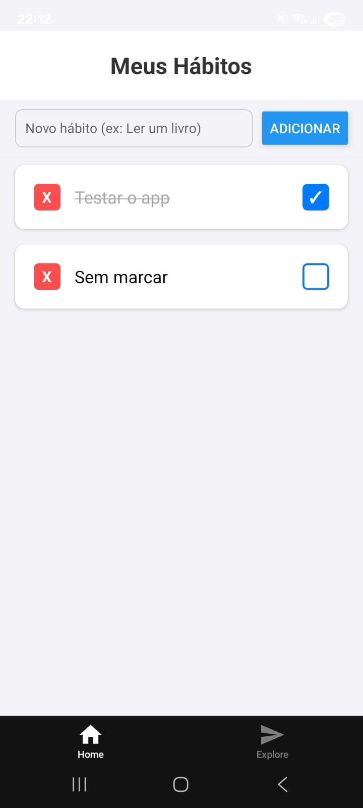

# 📱 App de Controle de Hábitos


Trabalho prático desenvolvido em React Native com Expo. O objetivo é permitir o registro e acompanhamento de hábitos diários.


## 📋 Funcionalidades e Requisitos Atendidos


* **Cadastro de Hábitos:** Input de texto e botão para adicionar à lista.

* **Listagem:** Visualização de todos os hábitos cadastrados.

* **Check de Conclusão:** Possibilidade de marcar/desmarcar um hábito como feito no dia.

* **Persistência de Dados:** Uso de `AsyncStorage` para que os dados não sumam ao fechar o app.

* **Hook Customizado:** Lógica centralizada no hook `useHabits`.

* **Componentização:** Interface dividida em `AddHabitForm` e `HabitCard`.


## 🚀 Como Rodar o Projeto


1. Clone o repositório.

2. Na pasta do projeto, instale as dependências:

```bash

npm install

```

3. Execute o projeto:

```bash

npx expo start

```

4. Escaneie o QR Code com o app **Expo Go** (Android/iOS).


## 📸 Interface do App


Abaixo, uma demonstração do aplicativo rodando em um dispositivo Android:





---

*Desenvolvido por Otávio Augusto de Assis Zinidarcis*